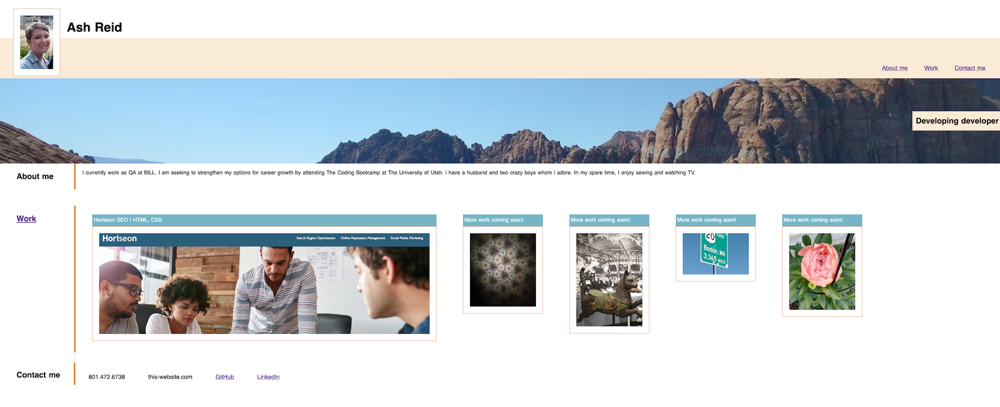

# Development Portfolio

As a budding developer, I have created a space to showcase my work to potential employers. 

This will allow me to easily share my favorite projects in an organized and accessible place. 

You'll see the following when you visit my page:
- My name
- A recent photo of me
- Links to various sections of the webpage
- A section about me
- A section of my work
- Links to current projects I have done
- A section with information to contact me
- Responsive layout

## Deployed application link

[My portfolio website](https://ashtreid.github.io/candidate-portfolio-portal/)

## Screenshot of my website

